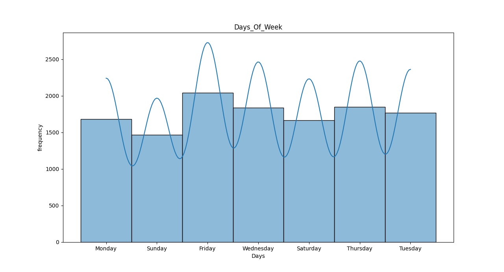
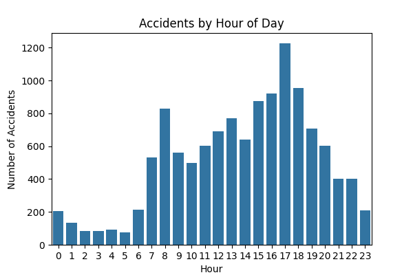
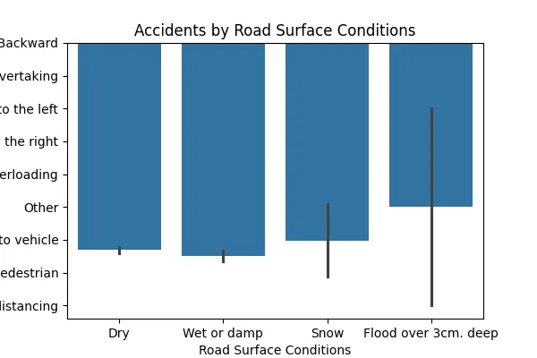
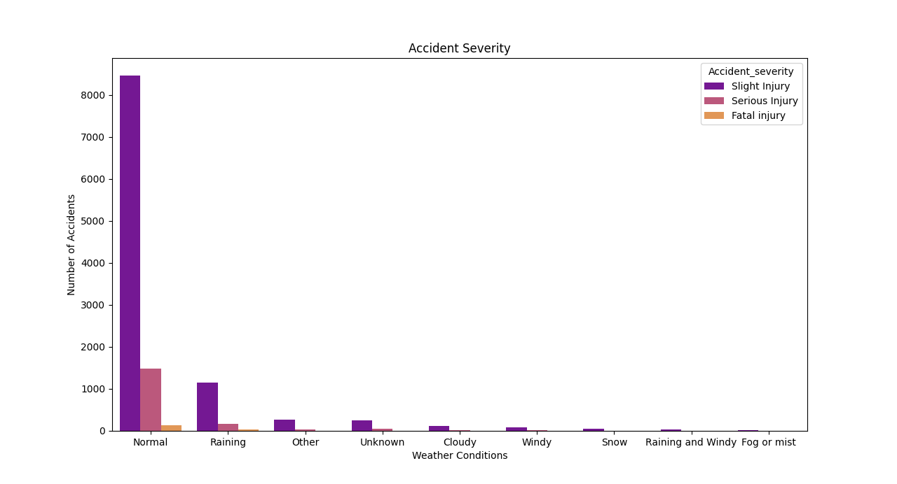
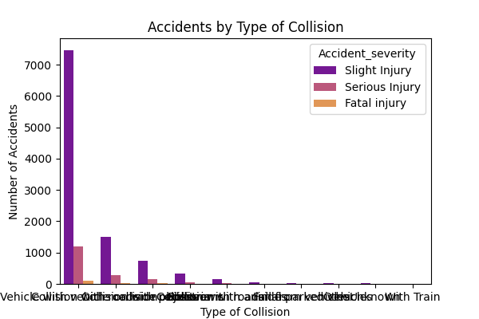

# 🚦 Accident Hotspot Analysis using Python
This project performs exploratory data analysis (EDA) on road traffic accident data to identify patterns, hotspots, and risk factors that contribute to accidents. The goal is to uncover actionable insights that can help improve road safety.

# This project analyzes road traffic accident (RTA) data to identify patterns in:
- Time of day
- Day of the week
- Road and weather conditions
- Severity of accidents
- Type of collisions
## 📊 Tools Used
- Python
- Pandas
- Seaborn
- Matplotlib
- Folium

## 📁 Dataset
[RTA Dataset](https://www.kaggle.com/datasets/sobhanmoosavi/us-accidents?resource=download)

## 📷 Visualizations
Includes histograms, bar charts, and severity breakdowns.

## 🧠 Insights Gained
🚗 Most accidents occurred during the Evening and Night.

🌧️ Accidents are more frequent under rainy or foggy weather.

🛣️ Wet or slippery roads significantly increase accident likelihood.

📍 Accident hotspots are concentrated in urban/high-traffic zones.

## 💻 How to Run
1. Clone this repository
2. Install requirements: `pip install pandas seaborn matplotlib folium`
3. Run the script in Jupyter Notebook or Python environment
